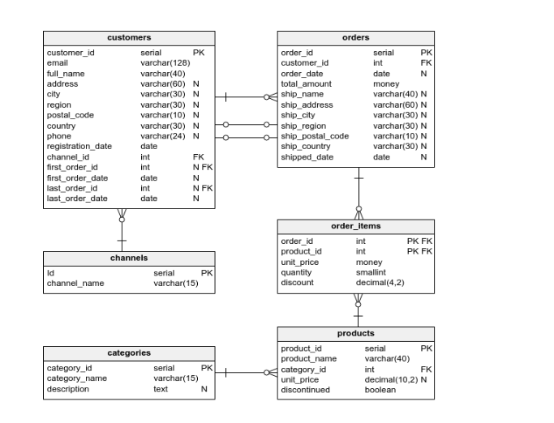

# 🚀 Customer Behavior Analytics using Advanced SQL

## 📌 Project Overview

This project focuses on analyzing the **complete customer lifecycle** using SQL.
It covers key business stages including:

* Customer Acquisition
* Conversion (Signup → Purchase)
* Engagement
* Retention
* Churn

The goal is to extract **meaningful business insights** from raw data using SQL techniques ranging from basic queries to advanced analytics.

---

## 🧠 Problem Statement

Understanding customer behavior is crucial for any business.
This project aims to:

* Analyze how customers are acquired
* Measure how many convert into paying users
* Track engagement and activity
* Identify churn patterns
* Segment high-value customers

---

## 📂 Dataset Description

The dataset consists of the following tables:

* **customers** → Customer details and registration info
* **orders** → Order-level data
* **order_items** → Product-level order details
* **products** → Product information
* **categories** → Product categories
* **channels** → Customer acquisition sources

---

## 📊 Data Model (ER Diagram)



---

## 📁 Project Structure

```
customer-behavior-sql-analysis
 ┣ README.md
 ┣ project_overview.md
 ┣ datasets/
 ┣ schema/
 ┃ ┣ data_model.sql
 ┃ ┗ er_diagram.png
 ┣ sql_queries/
 ┃ ┣ 01_acquisition.sql
 ┃ ┣ 02_conversion.sql
 ┃ ┣ 03_engagement.sql
 ┃ ┣ 04_business_logic.sql
 ┃ ┣ 05_funnel_analysis.sql
 ┃ ┣ 06_retention.sql
 ┃ ┣ 07_customer_value.sql
 ┃ ┣ 08_churn_analysis.sql
 ┃ ┣ 09_cohort_retention.sql
 ┃ ┣ 10_segmentation.sql
 ┃ ┗ 11_advanced_window_functions.sql
 ┣ insights/
 ┃ ┗ business_insights.md
 ┗ documentation/
```

---

## 🔍 Key Analysis Areas

### 📈 Acquisition Analysis

* Customer registrations over time
* Channel-wise acquisition trends
* Weekly and monthly growth patterns

### 💰 Conversion Analysis

* Conversion rates (signup → purchase)
* Channel-wise conversion performance
* Time to first purchase

### ⏱️ Engagement Analysis

* Customer activity patterns
* Average time to first order
* Behavioral trends post signup

### 🔁 Retention Analysis

* Active customers over time
* Repeat customer behavior
* Engagement trends

### ❌ Churn Analysis

* Customers becoming inactive
* Churn rate over time
* Early drop-off detection

### 📊 Funnel Analysis

* Registration → Purchase breakdown
* Time-based conversion buckets

### 🌟 Customer Segmentation

* High-value customers
* Good vs low-value users
* Revenue contribution analysis

---

## 🛠️ SQL Concepts Used

* Joins (INNER, LEFT)
* Aggregations (SUM, COUNT, AVG)
* Subqueries
* Common Table Expressions (CTEs)
* Window Functions (RANK, RUNNING TOTAL)
* Case Statements
* Date Functions
* Conditional Aggregation

---

## 📊 Key Insights

* Customer acquisition varies significantly across channels
* Conversion rates differ based on source of acquisition
* Faster first purchase leads to better retention
* A large percentage of users churn within the first few weeks
* High-value customers contribute disproportionately to revenue

---

## ⚙️ How to Use

1. Load dataset into your SQL environment
2. Run queries from `/sql_queries` folder
3. Analyze outputs and insights
4. Refer to `data_model.sql` for schema setup

---

## 🎯 Outcome

This project demonstrates:

* Strong SQL fundamentals
* Ability to solve real-world business problems
* Understanding of customer lifecycle analytics
* Structured and analytical thinking

---

## 🚀 Future Improvements

* Build ETL pipeline for automated data processing
* Integrate visualization tools (Power BI / Tableau)
* Extend analysis using Python

---

## 📌 Author

**Tushar Shinde**
Aspiring Data Engineer | SQL | Data Analytics

---

## ⭐ If you found this project useful, feel free to give it a star!
